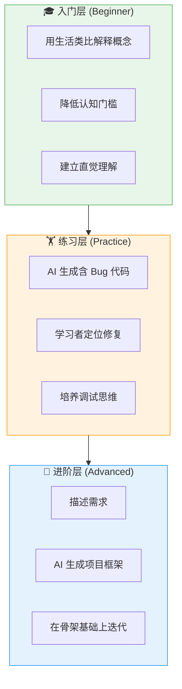
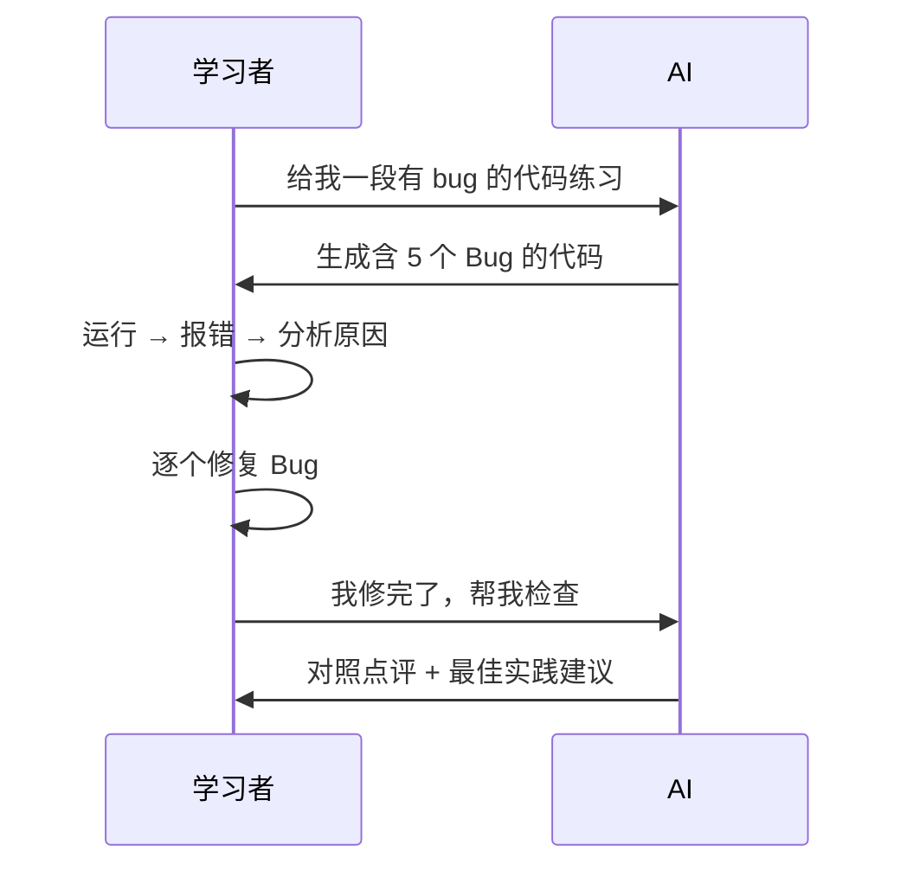
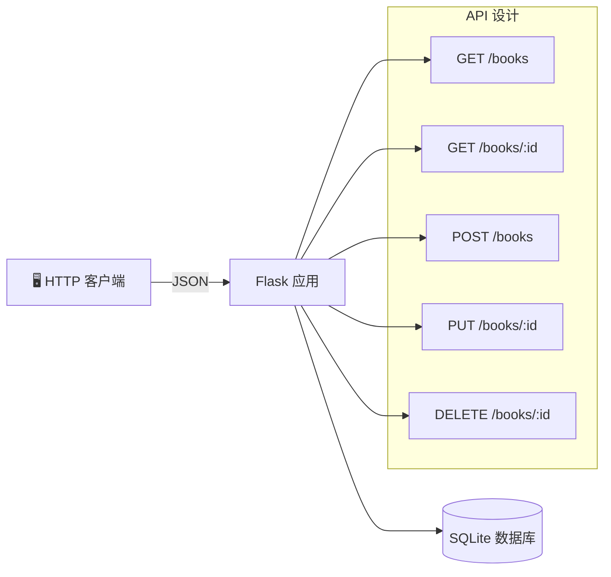
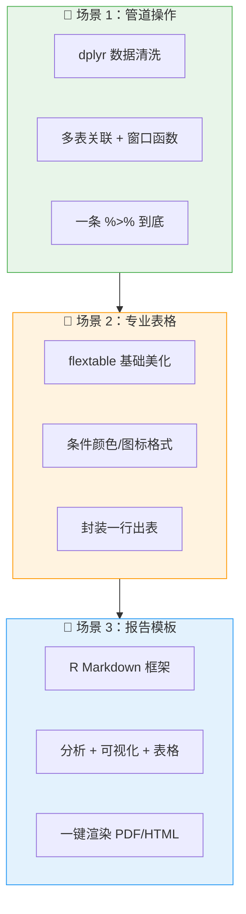
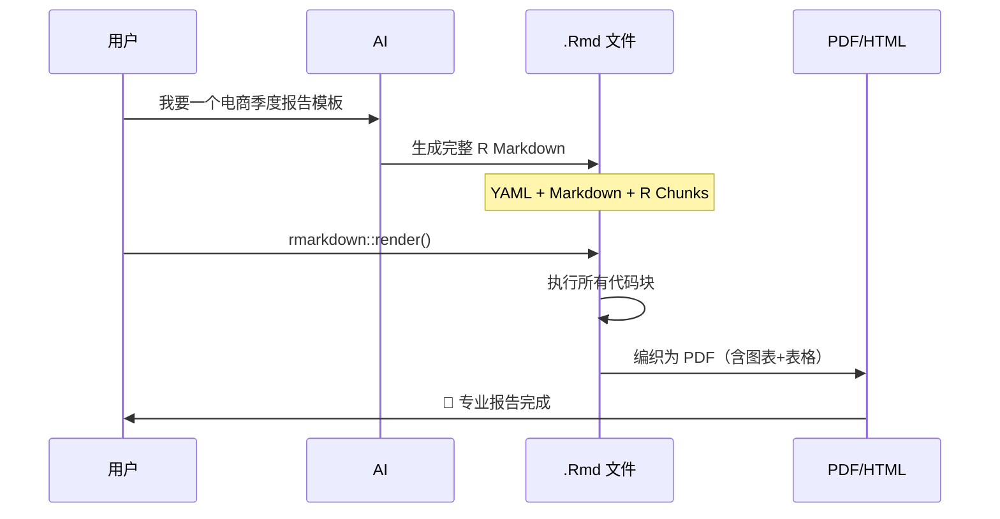
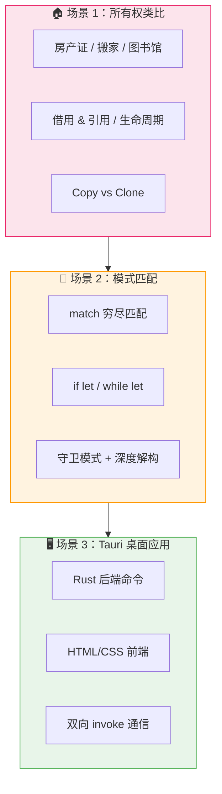
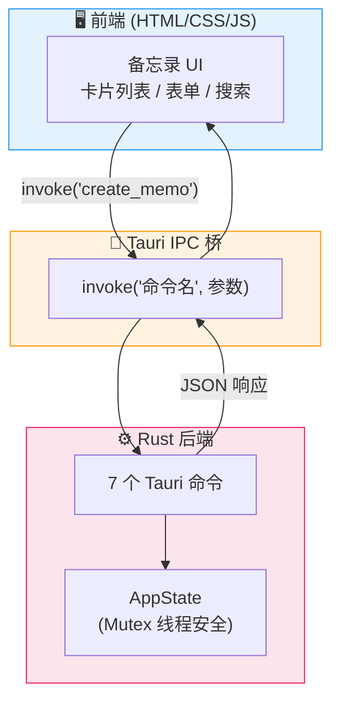
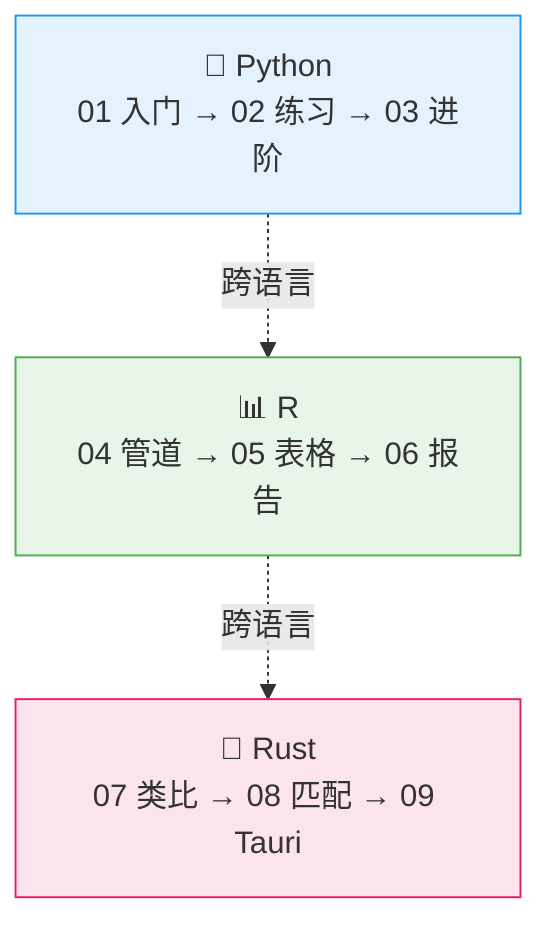

# AI 辅助学习的多层次架构

> 覆盖 Python + R 语言，从入门到进阶，AI 如何让编程学习变得直观高效

---

## 📐 架构总览



---

## 1. 入门层：直觉优先

| 要素 | 说明 |
|------|------|
| **文件** | `01_pandas入门_生活例子.py` |
| **核心理念** | 用日常场景（奶茶店记账）类比抽象概念（DataFrame 筛选） |
| **AI 作用** | 把 `df[df["列"] == 值]` 解释为「在纸质表格上荧光笔标注符合条件的行」 |
| **覆盖知识点** | 布尔索引、组合筛选 (`&` `\|`)、`.query()`、列选择 |

### 关键类比映射

| Pandas 操作 | 生活类比 |
|-------------|----------|
| `df[条件]` | 荧光笔标注符合条件的行 |
| `&` | 「并且」— 两个条件都要满足 |
| `\|` | 「或者」— 满足其一即可 |
| `.query("...")` | 直接用人话提问 |

---

## 2. 练习层：在错误中成长

| 要素 | 说明 |
|------|------|
| **文件** | `02_debug练习_找bug.py` |
| **核心理念** | 真实的 Bug 才是最好的老师，AI 刻意构造 5 类典型错误 |
| **AI 作用** | 生成有代表性的 Bug 代码，不直接给答案，引导思考 |

### 5 类 Bug 设计

| 编号 | Bug 类型 | 具体表现 | 学习目标 |
|------|----------|----------|----------|
| 1 | 类型错误 | score 是字符串 `"78"` | 注意数据类型转换 |
| 2 | 空值处理 | name 为 `None` | 防御性编程意识 |
| 3 | 数据校验 | score=105 超范围 | 业务规则验证 |
| 4 | 缺失字段 | 缺少 `score` 键 | KeyError 异常处理 |
| 5 | 边界条件 | 除零错误 | 空集合边界检查 |

### 典型学习流程



---

## 3. 进阶层：从需求到成品

| 要素 | 说明 |
|------|------|
| **文件** | `03_flask应用_图书管理.py` |
| **核心理念** | 你描述业务需求，AI 设计架构并生成可运行代码 |
| **AI 作用** | 设计 RESTful API 结构、数据库 Schema、错误处理 |

### 项目架构



### 代码分层

```
03_flask应用_图书管理.py
├── 数据库层 (get_db, init_db)
│   └── SQLite 连接管理 + 表初始化
├── 路由层 (5 个 API 端点)
│   ├── GET    /books      查询（支持筛选）
│   ├── GET    /books/<id> 详情
│   ├── POST   /books      新增
│   ├── PUT    /books/<id> 更新
│   └── DELETE /books/<id> 删除
└── 启动层 (__main__)
    └── 初始化数据库 + 启动开发服务器
```

### API 速查

| 方法 | 路径 | 功能 | 请求体 |
|------|------|------|--------|
| `GET` | `/books` | 列表（支持 `?author=`） | — |
| `GET` | `/books/1` | 详情 | — |
| `POST` | `/books` | 新增 | `{"title":"","author":"","year":0,"isbn":""}` |
| `PUT` | `/books/1` | 更新 | `{"title":"新书名"}` (部分字段) |
| `DELETE` | `/books/1` | 删除 | — |

---

# 📊 R 语言篇：数据科学全流程

> AI 辅助 R 语言的三个典型场景：管道操作 → 专业表格 → 一键报告

## 架构总览



---

## 4. 管道操作：一条链路完成分析

| 要素 | 说明 |
|------|------|
| **文件** | `04_R_dplyr管道操作.R` |
| **核心理念** | 用 `%>%` 管道把复杂分析变成流水线，从左读到右 |
| **AI 作用** | 「按品类分月统计销售额并排名」→ 自动翻译为 group_by + summarise + arrange |
| **覆盖知识点** | filter、mutate、group_by、summarise、arrange、inner_join、窗口函数 |

### 管道拆解示例

```r
orders %>%
  mutate(month = format(date, "%Y-%m")) %>%     # ① 添加月份
  filter(amount >= 10) %>%                      # ② 清洗异常值
  group_by(category, month) %>%                 # ③ 分组
  summarise(总销售额 = sum(amount * quantity)) %>% # ④ 汇总
  arrange(desc(总销售额))                        # ⑤ 排序
```

| 步骤 | 操作 | 类比 |
|------|------|------|
| `mutate` | 新增列 | 在表格右侧加一列 |
| `filter` | 筛行 | 荧光笔划掉不符合的行 |
| `group_by` | 分组 | 按颜色分开一叠卡片 |
| `summarise` | 聚合 | 每组算一个小计 |
| `arrange` | 排序 | 按数字从大到小重排 |

---

## 5. 专业表格：flextable 条件格式

| 要素 | 说明 |
|------|------|
| **文件** | `05_R_flextable条件格式.R` |
| **核心理念** | 表格即报告 — 颜色、图标、渐变让数据一目了然 |
| **AI 作用** | 「达标标绿，不达标标红」→ 自动写 `bg(i = ~ 条件, bg = 颜色)` |
| **输出** | 3 个 Word 文档：基础版、条件格式版、一行调用版 |

### 条件格式能力矩阵

| 格式类型 | 实现方式 | 典型场景 |
|----------|----------|----------|
| 颜色渐变 | `bg(j, bg = function(x) col_numeric(...))` | 销售额热力着色 |
| 条件着色 | `bg(i = ~ 完成率 >= 1.0, bg = "green")` | KPI 达标/不达标 |
| 图标嵌入 | `set_header_labels(销售额 = "💰 销售额")` | emoji 增强可读性 |
| 数字格式 | `colformat_double(digits = 1, suffix = "万")` | 自动加单位 |
| 斑马纹 | `bg(i = seq(2, n, 2), bg = "#eee")` | 隔行变色 |

---

## 6. 报告模板：一键生成 PDF

| 要素 | 说明 |
|------|------|
| **文件** | `06_R_Markdown报告模板.Rmd` |
| **核心理念** | 分析代码 + 可视化 + 表格 = 一个 .Rmd 文件 = 一份专业 PDF |
| **AI 作用** | 描述「电商季度报告，含趋势图、区域分析、品类热力图」→ 生成完整 .Rmd |
| **渲染命令** | `rmarkdown::render("06_R_Markdown报告模板.Rmd")` |

### 报告结构

```
06_R_Markdown报告模板.Rmd
├── YAML 头部（标题/作者/输出格式/参数）
├── 执行摘要（关键发现 + 数据概览）
├── 销售趋势分析（折线图 + 月度对比表）
├── 区域分析（柱状图 + 健康度诊断表）
├── 品类分析（饼图 + 交叉热力图）
├── 结论与建议（汇总表 + 行动项）
└── 附录（可复现性说明）
```

### 报告渲染流程



---

# 🦀 Rust 语言篇：系统编程不再可怕

> AI 辅助 Rust 的三个典型场景：所有权类比 → 模式匹配练习 → Tauri 桌面应用

## 架构总览



---

## 7. 所有权：用生活类比击穿 Rust 最难概念

| 要素 | 说明 |
|------|------|
| **文件** | `07_Rust_所有权_生活类比.rs` |
| **核心理念** | Rust 最难的概念用日常场景一一映射，让抽象变具体 |
| **AI 作用** | 「用生活例子解释所有权」→ 生成房产证/搬家/图书馆借书等 6 个类比 |

### 核心类比映射表

| Rust 概念 | 生活类比 | 一句话 |
|-----------|----------|--------|
| **所有权** | 房产证 | 一套房只有一个产权人 |
| **移动 (Move)** | 搬家 | 家具搬到新家，旧地址作废 |
| **借用 (&)** | 图书馆借书 | 看完归还，书还是图书馆的 |
| **可变借用 (&mut)** | 装修队进场 | 独占访问，装完才能给别人看 |
| **生命周期** | 电影票有效期 | 票不能比电影活得更久 |
| **Copy** | 便利贴数字 | 撕一份给你，原件不受影响 |
| **Clone** | 复印整本书 | 费时费力，但得到两本独立的 |

### 三大铁律

```
规则 1：一个值只有一个所有者（一个房子一个房产证）
规则 2：所有者离域，值即释放（拆迁后房产证作废）
规则 3：共享只读 ∃ 独占可写（多人看房 ∄ 同时装修）
```

---

## 8. 模式匹配：Rust 最强大的控制流工具

| 要素 | 说明 |
|------|------|
| **文件** | `08_Rust_模式匹配练习.rs` |
| **核心理念** | match 是穷尽的，编译器帮你查漏补缺 |
| **AI 作用** | 设计 6 个从简单到复杂的实战练习场景 |

### 6 个练习场景

| 练习 | 场景 | 核心知识点 |
|------|------|------------|
| 🚦 交通灯 | 状态机 + 枚举 | match 穷尽匹配、通配符 |
| 🌐 HTTP 响应 | 状态码处理 | 范围匹配、多值匹配 `\|` |
| 🧮 表达式求值 | 递归 AST | 递归 match、Option 错误处理 |
| 📦 Result/Option | 空值安全 | if let、while let、`?` 运算符 |
| 🔍 深度解构 | 嵌套结构体 | 结构体/元组解构、`@` 绑定 |
| 🛡️ 守卫模式 | 条件匹配 | match + if 守卫、配对匹配 |

### 模式匹配速查

| 语法 | 含义 | 示例 |
|------|------|------|
| `match 值 { 模式 => 动作 }` | 穷尽匹配 | `match code { 200 => "OK" }` |
| `if let 模式 = 值 { }` | 只匹配一种 | `if let Some(x) = opt { }` |
| `while let 模式 = 值 { }` | 循环解构 | `while let Some(top) = stack.pop()` |
| `200..=299` | 范围匹配 | HTTP 成功状态码 |
| `A \| B \| C` | 多值匹配 | 重定向状态码 |
| `模式 if 条件` | 守卫 | `s if s >= 90 => "A+"` |
| `_` | 通配符 | 兜底匹配 |

---

## 9. Tauri 桌面应用：10 分钟搭建全栈桌面软件

| 要素 | 说明 |
|------|------|
| **文件** | `09_Rust_Tauri应用/`（Cargo.toml + main.rs + index.html） |
| **核心理念** | Rust 做后端（安全+性能），Web 技术做前端（灵活+美观） |
| **AI 作用** | 「备忘录桌面应用」→ 生成数据结构 + 7 个 Tauri 命令 + 完整前端 |

### 架构图



### 项目结构

```
09_Rust_Tauri应用/
├── Cargo.toml          ← 依赖：tauri + serde + chrono
├── src/
│   └── main.rs         ← Rust 后端（数据结构 + 7 个命令 + 状态管理）
└── index.html          ← 前端（搜索 + 新建 + 编辑 + 置顶 + 删除）
```

### 7 个 Tauri 命令

| 命令 | 功能 | 前端调用 |
|------|------|----------|
| `get_memos` | 获取列表（支持搜索+标签筛选） | `invoke('get_memos', { search })` |
| `create_memo` | 新建备忘录 | `invoke('create_memo', { title, content, tags })` |
| `update_memo` | 更新备忘录 | `invoke('update_memo', { id, title, ... })` |
| `toggle_pin` | 切换置顶 | `invoke('toggle_pin', { id })` |
| `delete_memo` | 删除备忘录 | `invoke('delete_memo', { id })` |
| `get_all_tags` | 获取所有标签 | `invoke('get_all_tags')` |
| `get_stats` | 统计信息 | `invoke('get_stats')` |

### 数据流

```mermaid
sequenceDiagram
    participant 用户
    participant HTML as 前端 HTML/CSS
    participant JS as 前端 JS
    participant Tauri as Tauri IPC
    participant Rust as Rust 后端
    participant State as Mutex&lt;AppState&gt;

    用户->>HTML: 点击「新建」
    HTML->>JS: showForm()
    用户->>HTML: 填写标题+内容+标签
    HTML->>JS: saveMemo()
    JS->>Tauri: invoke('create_memo', {title, content, tags})
    Tauri->>Rust: create_memo() 命令
    Rust->>State: lock().push(memo)
    State-->>Rust: Ok(memo)
    Rust-->>Tauri: JSON Memo
    Tauri-->>JS: Promise resolve
    JS->>HTML: renderMemos()
    HTML-->>用户: 📝 备忘录卡片出现！
```

---

# 🔗 全文件索引

| 编号 | 文件 | 语言 | 层级 | 核心能力 |
|------|------|------|------|----------|
| 00 | `00_AI辅助学习架构.md` | — | 总览 | 架构文档（本文件） |
| 01 | `01_pandas入门_生活例子.py` | Python | 入门 | pandas 筛选 + 生活类比 |
| 02 | `02_debug练习_找bug.py` | Python | 练习 | 5 类 Bug 调试训练 |
| 03 | `03_flask应用_图书管理.py` | Python | 进阶 | Flask RESTful API 项目 |
| 04 | `04_R_dplyr管道操作.R` | R | 入门 | dplyr 管道 + 多表关联 |
| 05 | `05_R_flextable条件格式.R` | R | 进阶 | flextable 条件颜色/图标 |
| 06 | `06_R_Markdown报告模板.Rmd` | R | 高级 | 一键 PDF 报告生成 |
| 07 | `07_Rust_所有权_生活类比.rs` | Rust | 入门 | 所有权 6 大生活类比 |
| 08 | `08_Rust_模式匹配练习.rs` | Rust | 练习 | 6 个模式匹配实战场景 |
| 09 | `09_Rust_Tauri应用/` | Rust | 进阶 | Tauri 桌面应用全栈项目 |

### 学习路径建议



---

## 🚀 快速开始

```bash
# === Python 篇 ===
python 01_pandas入门_生活例子.py       # 入门 - pandas 筛选
python 02_debug练习_找bug.py            # 练习 - 调试 Bug
pip install flask && python 03_flask应用_图书管理.py  # 进阶 - Flask API

# === R 语言篇 ===
Rscript 04_R_dplyr管道操作.R            # 管道操作
Rscript 05_R_flextable条件格式.R        # 条件格式表格
R -e "rmarkdown::render('06_R_Markdown报告模板.Rmd')"  # 渲染 PDF 报告

# === Rust 篇 ===
rustc 07_Rust_所有权_生活类比.rs && ./07_Rust_所有权_生活类比  # 入门 - 所有权
rustc 08_Rust_模式匹配练习.rs && ./08_Rust_模式匹配练习        # 练习 - 模式匹配
cd 09_Rust_Tauri应用 && cargo build                           # 进阶 - Tauri 桌面应用
```

---

> 💡 **核心理念**：AI 不是替代思考，而是降低每一层的门槛——
> 入门时当翻译官，练习时当出题人，进阶时当架构师；
> 跨语言时当桥梁，让 Python、R、Rust 的学习路径一样顺畅。
