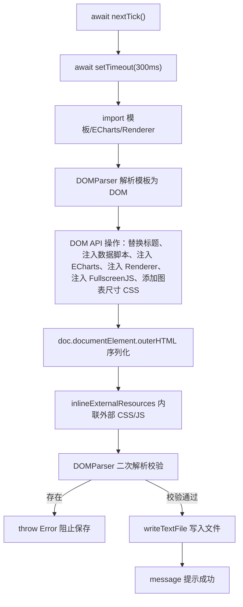

# Save Dashboard HTML 函数重构记录

> 日期：2026-06-24  
> 涉及文件：`src/views/DashboardView.vue`、`templates/result_template.html`

---

## 一、背景

原 `saveDashboard` 函数使用**字符串拼接 + 模板占位符替换**的方式生成独立 HTML 文件，多次出现以下问题：

1. **字符转义错误**：如 `<\/script>` 中反斜杠导致 JavaScript 语法错误，阻止后续脚本执行
2. **模板占位符错乱**：JSON 数据直接嵌入 HTML 文本中，特殊字符（如 `</script>`）未正确处理
3. **资源加载失败**：外部 CSS/JS 引用路径在独立 HTML 中无效
4. **无结构校验**：拼接完成后直接写入文件，错误 HTML 无法及时发现

---

## 二、核心设计思路

```
旧流程：模板字符串 → .replace() 占位符替换 → 拼接脚本标签 → 直接写入文件
新流程：await nextTick() → DOMParser 解析模板 → DOM API 注入 → outerHTML 序列化
         → inlineExternalResources() 内联外部资源 → DOMParser 二次校验 → 写入文件
```

**关键原则**：让浏览器（DOMParser）负责 HTML 结构的解析和序列化，避免手动字符串拼接。

---

##三、修改详情

### 3.1 `src/views/DashboardView.vue`

#### 3.1.1 `saveDashboard` 函数 — 整体流程

| 步骤 | 旧方法 | 新方法 |
|------|--------|--------|
| ① 等待渲染 | ❌ 无 | `await nextTick()` + `await new Promise(resolve => setTimeout(resolve, 300))` |
| ② HTML 构建 | 字符串 `.replace()` 逐个替换 18 个模板占位符 | DOMParser 解析模板为 DOM → DOM API 操作节点 → `outerHTML` 序列化 |
| ③ 脚本注入 | `'<script>' + code + '<\/script>'` 字符串拼接 | `doc.createElement('script')` + `textContent` 赋值，浏览器自动处理标签闭合 |
| ④ Fullscreen JS | 模板字面量 `\\/script>` 双转义 | 数组 `join('\n')` 构建代码 → 通过 DOM API 注入 |
| ⑤ 外部资源内联 | ❌ 完全不处理 | 扫描 `<link rel="stylesheet">` 和 `<script src>`，从当前页面提取内容内联 |
| ⑥ 结构校验 | ❌ 无 | DOMParser 二次解析 → 检查 `<parsererror>` 元素 |
| ⑦ 文件写入 | 校验前直接写入 | **校验通过后才执行 `writeTextFile`** |

#### 3.1.2 数据结构注入

旧方法：18 个独立占位符分别替换
```javascript
// 旧：逐个 JSON.stringify + replace
.replace(/\{\{HEADERS_JSON\}\}/g, JSON.stringify(headers))
.replace(/\{\{ROWS_JSON\}\}/g, JSON.stringify(rows))
// ... 共 18 个
```

新方法：构建完整 `dataObj`，一次 `JSON.stringify`，通过 DOM API 注入
```typescript
// 新：DOM API 整体注入
const dataObj: Record<string, any> = {
  title, headers, rows, classifications: cls,
  filterSpecs, kpiSpecs, chartSpecs,
  metricDefaults, tableColumns, tableSortBy,
  tableRowLimit, tableColColors, tableRowCondColors,
  dateRange, dateStart, dateEnd, locale: locale.value,
}
dataScript.textContent =
  `var __DATA__ = ${JSON.stringify(dataObj)};\n` +
  `var __I18N__ = ${JSON.stringify(i18nData)};`
```

#### 3.1.3 新增辅助函数

```typescript
// 内联外部资源入口
async function inlineExternalResources(html: string): Promise<string>

// 从当前页面查找匹配 href 的样式表内容
function findLiveStyleSheet(href: string): string | null

// 从当前页面查找匹配 src 的脚本内容
function findLiveScriptContent(src: string): string | null
```

**`inlineExternalResources` 流程：**
1. DOMParser 解析传入的 HTML
2. 查询 `link[rel="stylesheet"][href]` → 提取当前页面匹配样式表 → 替换为 `<style>` 内联
3. 查询 `script[src]` → 尝试获取脚本源码 → 替换为内联 `<script>`
4. 序列化回 HTML 字符串

**`findLiveStyleSheet` 流程：**
1. 遍历 `document.styleSheets`
2. 按 `href` 末尾匹配或完整匹配
3. 遍历 `cssRules` 提取所有 CSS 文本
4. 返回完整 CSS 字符串

**`findLiveScriptContent` 说明：**
- 由于浏览器安全限制，已执行的 `<script src>` 无法直接获取源码
- 当前返回 `null`，保留原标签
- 预留 `fetch` 回退方案（适用于同源资源）

### 3.2 `templates/result_template.html`

#### 占位符精简

| 变更 | 旧 | 新 |
|------|----|----|
| 数据块 | 18 个独立占位符 | 统一为 `var __DATA__ = {...}` 骨架（由 DOM API 整体替换） |
| Renderer JS | `{{RENDERER_JS}}` 裸文本 | `<script>{{RENDERER_JS}}</script>` 包裹 |
| Fullscreen JS | `{{FULLSCREEN_JS}}` 裸文本 | `<script>{{FULLSCREEN_JS}}</script>` 包裹 |

---

## 四、流程图



---

## 五、解决的问题

| 问题类型 | 根因 | 解决方案 |
|----------|------|----------|
| `<\/script>` 语法错误 | 字符串拼接 JS 代码时转义不当 | DOM API 通过 `textContent` 注入脚本，浏览器自动处理闭合 |
| 模板占位符错乱 | 字符串 `.replace()` 对特殊字符敏感 | DOMParser 解析模板，通过 DOM 节点查找+替换，无转义问题 |
| 外部资源加载失败 | 独立 HTML 中引用路径无效 | `inlineExternalResources` 内联 CSS 和 JS 资源 |
| HTML 结构错误无法发现 | 无校验环节 | DOMParser 二次解析 + `<parsererror>` 检测 |
| 图表未渲染完成就保存 | 无等待机制 | `await nextTick()` + 300ms 延迟 |
| 图表卡片尺寸丢失 | 字符串拼接 CSS 位置不稳定 | DOM API 精确找到 `<style>` 元素追加 CSS |

---

## 六、文件清单

| 文件 | 变更类型 | 描述 |
|------|----------|------|
| `src/views/DashboardView.vue` | 重写 | `saveDashboard` 函数 + 3 个辅助函数 |
| `templates/result_template.html` | 简化 | 占位符从 18 个精简为 3 个，包裹在 `<script>` 标签内 |
| `src/save/entry.ts` | 新增+修改 | `enhanceToolbox`、`browserDownload`、`optionToCSV`；对齐 Vue 工具箱 |
| `src/core/chart-options.ts` | 修改 | 复制表格按钮从内联 `onclick` 改为事件委托 |
| `Makefile` | 修改 | 新增 `build-save` 目标，挂载到 `dev`/`build`/`release`/`check` |
| `dist-standalone/renderer.js` | 重新编译 | `npm run build:save` 编译产物，save 功能导入此文件 |

---

## 七、⚠️ 重要设计差异：Toolbox 下载按钮的双轨制

Vue 程序（Tauri 桌面端）和独立 HTML（浏览器端）的 Toolbox 下载按钮采用了 **不同的实现策略**，这是由运行环境决定的**有意设计差异**，不是遗漏。

### 差异对照表

| 功能 | Vue 程序（Tauri） | 独立 HTML（浏览器） |
|------|-------------------|---------------------|
| **PNG 下载** | `mySaveAsImage` 自定义按钮 → `useChartDownload` composable → Tauri `save` 对话框 + `writeFile` | ECharts 原生 `saveAsImage`（浏览器直接触发下载，无需自定义） |
| **CSV 下载** | `mySaveCSV` 自定义按钮 → Tauri `save` 对话框 + `writeTextFile` | `mySaveCSV` 自定义按钮 → `Blob` + `URL.createObjectURL` + `<a>.click()` |
| **原生 saveAsImage** | ❌ 删除（避免与 Tauri 对话框冲突） | ✅ 保留（浏览器原生支持完美） |

### 为什么不能统一？

1. **Tauri 环境**：`navigator.clipboard` / Blob 下载受限于 WebView 沙箱，使用 Tauri 原生 `@tauri-apps/plugin-dialog` + `@tauri-apps/plugin-fs` 是最稳定方案
2. **浏览器环境**：Tauri API 完全不可用，但 ECharts 原生 `saveAsImage` 和 Blob 下载在浏览器中完美工作

### 代码位置

| 环境 | 文件 | 关键函数 |
|------|------|----------|
| Tauri | `src/components/dashboard/*.vue` | `useChartDownload()` composable |
| Tauri | `src/composables/use-chart-download.ts` | `downloadPNG`, `downloadCSV` |
| 浏览器 | `src/save/entry.ts` | `enhanceToolbox()`, `browserDownload()`, `optionToCSV()` |

### 维护注意事项

- ⚠️ 修改 Toolbox 功能时，**两个环境都要检查**
- ⚠️ 不要试图把 Tauri 的 `save`/`writeFile` 逻辑搬到 `entry.ts`（独立 HTML 没有 Tauri 运行时）
- ⚠️ 不要删除独立 HTML 的 `saveAsImage`（ECharts 原生功能在浏览器中稳定可靠）
- ✅ 两个环境的 CSV 下载逻辑可以共享 `optionToCSV` 提取算法（目前已独立实现，如有需要可抽取为公共模块）
